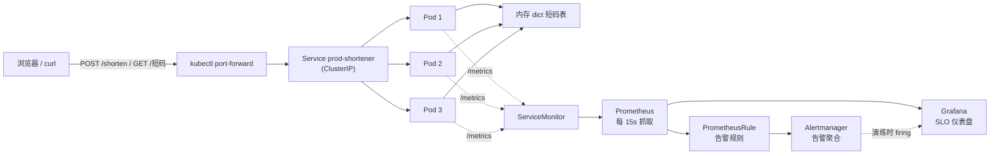

# SRE From Zero — URL 短链服务 + 完整可观测性闭环

> 个人学习项目：用 10 天从零搭建一个可运行的 SRE 实践闭环 —— 本地 k3d 集群上部署 FastAPI 短链服务，接入 Prometheus + Grafana 可观测体系，配置 SLI/SLO 与告警规则，并完成一次真实的故障演练与 Postmortem。
>
> 定位：**诚实的学习项目**。不是生产级系统，但覆盖了 SRE 的完整链路。

---

## 架构



**部署拓扑**：单节点 k3d（k3s in Docker）+ 3 副本 Deployment + ClusterIP Service + HPA（CPU 70% 自动伸缩）+ kube-prometheus-stack 全家桶。

## 技术栈

| 层 | 工具 |
|----|------|
| 应用 | Python · FastAPI · prometheus-client |
| 容器/集群 | Docker · k3d (k3s) · kubectl · Helm |
| 编排 | Deployment/Service/HPA · kustomize（base + dev/prod overlay）|
| 可观测 | kube-prometheus-stack · Prometheus · Grafana · Alertmanager |
| 运维实践 | 分层排查 · Blameless Postmortem · 故障演练 |

## 快速开始

**前置要求**：Docker Desktop（运行中）、[k3d](https://k3d.io/)、kubectl、Helm；国内网络建议配置[Docker/集群镜像站](#附录镜像站配置)。

```bash
# ① 创建本地集群（固定 API 端口 + 注入镜像站配置）
k3d cluster create sre-demo \
  --api-port 127.0.0.1:6443 \
  --registry-config k8s/registries.yaml

# ② 构建应用镜像并喂入集群
docker build -t shortener:0.5.0 .
k3d image import shortener:0.5.0 -c sre-demo

# ③ 部署业务（prod 环境：3 副本 + HPA）
kubectl apply -k k8s/overlays/prod

# ④ 安装监控全家桶
kubectl create namespace monitoring
helm install kps prometheus-community/kube-prometheus-stack -n monitoring \
  --set prometheus.prometheusSpec.serviceMonitorSelectorNilUsesHelmValues=false

# ⑤ 访问
kubectl port-forward svc/prod-shortener -n shortener-prod 8080:80   # 短链服务
kubectl port-forward svc/kps-grafana -n monitoring 3000:80          # Grafana
# Grafana 默认账号 admin，密码从 Secret 读取：
# kubectl get secret -n monitoring kps-grafana -o jsonpath="{.data.admin-password}" | base64 -d
```

**快速验证**：

```bash
curl -X POST http://127.0.0.1:8080/shorten \
  -H "Content-Type: application/json" \
  -d '{"url":"https://www.example.com/very/long/path"}'
# → {"short_code":"xxxx","short_url":"/xxxx","long_url":"..."}
curl -i http://127.0.0.1:8080/xxxx        # 302 跳转
curl http://127.0.0.1:9090/api/v1/query?query=shortener_clicks_total   # 指标已入库
```

## SLO 定义

| SLO | SLI 公式 | 阈值 |
|-----|---------|------|
| 可用性 · 99.9% | `sum(rate(http_requests_total{status!~"5.."}[5m])) / sum(rate(http_requests_total[5m]))` | ≥ 99% |
| 延迟 · P99 < 200ms | `histogram_quantile(0.99, sum by (le) (rate(http_request_duration_seconds_bucket[5m])))` | ≤ 0.2s |

实测基线：可用性 100%，P99 ≈ 2.5~5ms（余量充足）。

## 告警规则（PrometheusRule）

| 告警 | 表达式要点 | for | severity |
|------|-----------|-----|----------|
| HighErrorRate | 5xx 占比 > 1% | 2m | critical |
| HighP99Latency | P99 > 200ms | 5m | warning |

完整定义见 `k8s/overlays/prod/alerts.yaml`。告警链路已在故障演练中验证：`inactive → pending → firing → 自动恢复` 全生命周期走通（详见 Postmortem）。

## 目录结构

```
sre-from-zero/
├── app/                    # FastAPI 短链服务（含 /metrics、?slow= 演练注入点）
├── k8s/
│   ├── registries.yaml     # 集群镜像站配置（docker.io / registry.k8s.io）
│   ├── base/               # Deployment/Service/HPA/ServiceMonitor 公共骨架
│   └── overlays/
│       ├── dev/            # dev 环境（前缀+命名空间）
│       └── prod/           # prod 环境（补丁：3副本/HPA 3-10/告警规则）
├── postmortems/            # 故障复盘（Google SRE 模板）
├── Dockerfile              # 多阶段构建
└── requirements.txt
```

## 已知限制（诚实清单）

- **镜像未瘦身**：`shortener:0.5.0` 解压后 `docker image ls` SIZE ≈ 250MB，未做 alpine 瘦身（<200MB 目标未达成）
- **内存存储**：短码表在进程内存中，服务重启/重建即全部丢失（生产应换 Redis）
- **单节点集群**：k3d 单节点，无跨 AZ 高可用
- **无 IaC/GitOps**：未接 Terraform 与 ArgoCD，部署为 `kubectl apply`
- **SLI 口径盲区**：可用性 SLI 仅统计 5xx，4xx（含 404）计为"可用"——是决策，也是已知盲区
- **k3d image import 兼容性**：部分 Docker Hub 镜像（层格式特殊）在 k3s 1.35 上导入会报 `ctr: content digest not found`（本项目本地构建镜像不受影响）
- **无完整日志栈**：仅 stdout JSON，未接 Loki
- **告警通知未接入**：Alertmanager 已运行，未配置钉钉/邮件等接收端

## 附录：镜像站配置

国内网络下，宿主 Docker 与集群节点分别需要镜像站：

- **宿主**：Docker Desktop → Settings → Docker Engine → `registry-mirrors`
- **集群**：`k8s/registries.yaml`（docker.io → docker.m.daocloud.io，registry.k8s.io → k8s.m.daocloud.io），随集群创建注入
- 镜像站可用性会波动：pull 大镜像卡住时，重试/换站的性价比远高于干等

## 相关文档

- [Postmortem: 高延迟故障注入演练](postmortems/2026-9-14-p99alert-drill.md)
- [ROADMAP: 十日计划与面试准备](ROADMAP.md)