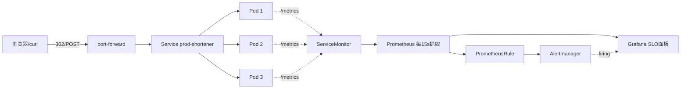

# 从零搭建一个生产级 SRE 实践平台：URL 短链 + K8s + 完整可观测性

> 一个零经验候选人的 10 天 SRE 闭环——以及那场「故障注入失败了，但告警还是响了」的事故

---

## 为什么做这个

我没有任何 SRE/运维工作经验。看岗位jd时发现，大多数岗位要求"可验证的监控/告警/事故处理能力"，而我两手空空。

所以给自己立了个目标：**10 天，从零搭一个完整的 SRE 实践闭环**——一个真实能跑的服务、一套真实的监控告警体系、一次真实的故障演练和复盘。不追求生产级（那本来就需要真实流量），只追求一条链路的每一环都亲手摸过、都能讲明白。

这个项目就是这么来的。

## 项目全貌

- **应用**：FastAPI 短链服务（POST /shorten 生成短码，GET /短码 302 跳转，/stats 查点击，/metrics 暴露指标），短码用 base62 编码，存储先用内存 dict
- **集群**：k3d（k3s in Docker）单节点本地集群
- **部署**：Deployment 3 副本 + ClusterIP Service + HPA（CPU 70% 自动伸缩）——用 kustomize 拆了 base/dev/prod 三层
- **可观测**：kube-prometheus-stack 全家桶（Prometheus + Grafana + Alertmanager），ServiceMonitor 自动发现服务，两条 SLO 告警规则
- **SLO**：可用性 99.9%（错误率红线 1%）、P99 延迟 < 200ms

架构图长这样（红色虚线是演练时的告警路径）：



## 十天都干了什么

| Day | 内容 |
|-----|------|
| 1 | Docker 基础 + 多阶段构建 Dockerfile |
| 2 | k3d 起集群 + kubectl 部署 nginx |
| 3 | FastAPI 短链核心逻辑 |
| 4 | prometheus-client 四件套指标 + 镜像瘦身尝试 |
| 5 | Deployment/Service/HPA + kustomize |
| 6 | 装 kube-prometheus-stack |
| 7 | SLO 面板 + 告警规则 |
| 8 | 故障演练 |
| 9 | Blameless Postmortem |
| 10 | README + 这篇博客 |

## 五座山

**第一座山：GitHub 和 Docker Hub 一起被墙。** 装 k3d 时 winget 下载失败（0x80072efd），配 Docker 镜像站时连 JSON 标点都写错过（中文逗号，Python 和 JSON 都只认英文逗号）。然后是集群节点内 containerd 的镜像站——**它和宿主 Docker 的镜像站是两套东西**，节点直连 Docker Hub 直接被掐，pod 卡在 ContainerCreating 半小时。最后靠 `registry.k8s.io` 的国内镜像站 + 重建集群解决。**经验：一个镜像站只救一个仓库；大镜像拉不动，重试一次往往就好（镜像站缓存会变热）。**

**第二座山：k3d image import 失败。** k3s 1.35 的 `ctr` 导入部分 Docker Hub 镜像会报 `content digest not found`（疑似层格式兼容问题），但**本地构建的镜像导入却没问题**。

**第三座山：WSL2 之下没有端口映射。** 集群跑在 WSL2 里，NodePort 从宿主机访问直接超时，因为 Docker Desktop 只代理创建时用 `-p` 显式声明的端口。理解了"端口声明"机制，就知道为什么 `kubectl port-forward` 永远是本地开发的万能钥匙。

**第四座山：动态路由吞静态路由。** `/{code}` 动态路由如果定义在 `/stats/{code}` 前面，访问 /stats/abc 时 "stats" 会被当成短码。路由顺序是短链服务的经典翻车点。

**第五座山：SLI 口径的盲区。** 我们的可用性 SLI 只统计 5xx，404 算"可用"。演练时 7 万多个 404 涌入，可用性面板纹丝不动。**100% 可用 ≠ 服务健康**——这是监控口径的固有盲区，写进 README 的"已知限制"了。

## 高潮：那场 404 故障演练

Day 8，计划是注入延迟故障（`?slow=2`），观察 P99 超过 200ms 后告警。

我下了压测工具 hey并运行相关指令。

六分钟后看结果，先是注意到**告警真的响了**：`HighP99Latency ... firing ... value 0.249`，延迟 SLO 从 inactive 走到 pending 再走到 firing，`for: 5m` 防抖、30 秒评估周期。然后看到了压测输出里的这一行：

```
Status code distribution: [404] 77749 responses
```

**77749 个 404，0 个 302。** 我的 URL 里写的是占位符 `<CODE>`，没换成真实短码。所有请求走 404 快速路径，**那行 `sleep(2)` 一次都没执行过**。

可告警还是响了。因为 7.7 万个请求、216 rps 压着单个 pod，uvicorn 同步端点线程池被排队填满，于是延迟SLO告警了。

而可用性面板全程 100%——因为 404 不算 5xx。

这份突然的事故成了一篇 Postmortem 最好的素材：5 Whys，从"为什么注入没生效"追到"为什么流程里没有前置验证"；Action Items 一条条能溯源回对应的 Why。**且对Blameless 有了些许理解，明白应该把"我理解错了"改写成"流程缺了检查点"。**

## 收获

- **K8s**：集群就是容器 + 标签 + 声明式清单；"节点"和"pod"是两个网络平面的两种身份
- **监控是分层的**：Prometheus Operator 通过标签选择器（Selector）来找到需要管理的 ServiceMonitor ；分位数不能直接跨实例平均，必须先聚合再计算；4xx 是“客户端错误”，不是“服务端故障”
- **告警的完整生命周期**：inactive → pending → firing → 自动恢复
- **基础设施是可丢弃的**：碰到不需要取证的坏集群或坏容器直接删了重建即可；配置即代码，一行 apply 指令即可再次拉起来

## 诚实限制

- 镜像没瘦身：250MB（Roadmap 的目标是 <200MB，"延迟优化"）
- 短码存在内存里，重启即丢——生产用 Redis 永久化
- 单节点集群、无 Terraform、无 GitOps、无日志聚合栈
- 告警只响在 Alertmanager 里，没有接入钉钉/邮件

## 结尾

这份项目 GitHub 地址：[sre-from-zero](https://github.com/Xiaoyu-hub/sre-from-zero)。（后续可能还会更新全流程CI/CD、混沌工程等）

[Postmortem: 高延迟故障注入演练](postmortems/2026-9-14-p99alert-drill.md)

如果你也是零经验想干 SRE：**不妨亲手跑起来一个集群、弄坏它、再修复它。** 弄坏和修复的过程，才是简历写不出来的那部分。